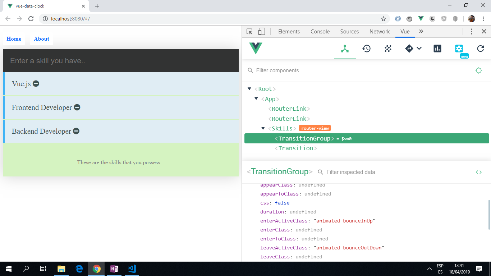

# :zap: Vue Forms Validation

* Vue app to add strings of text ('skills') to an existing list. With each entry there is a delete button. Input validation is used to prevent empty strings or strings of less than 5 charaters from being added to the list.

**\* Note: to open web links in a new window use: _ctrl+click on link_**

## :page_facing_up: Table of contents

* [:zap: Vue Forms Validation](#zap-vue-forms-validation)
  * [:page_facing_up: Table of contents](#page_facing_up-table-of-contents)
  * [:books: General info](#books-general-info)
  * [:camera: Screenshots](#camera-screenshots)
  * [:signal_strength: Technologies](#signal_strength-technologies)
  * [:floppy_disk: Setup](#floppy_disk-setup)
  * [:computer: Code Examples](#computer-code-examples)
  * [:cool: Features](#cool-features)
  * [:clipboard: Status & To-Do List](#clipboard-status--to-do-list)
  * [:clap: Inspiration](#clap-inspiration)
  * [:envelope: Contact](#envelope-contact)

## :books: General info

* This tutorial project used Vue Components, Templating, Input Verification, Styling, Forms, Animation, Routing.

## :camera: Screenshots

.

## :signal_strength: Technologies

* [Vue framework v2.6](https://vuejs.org/)
* [Vue Router v3](https://router.vuejs.org/) the official router for Vue.js
* [Vue CLI v4](https://cli.vuejs.org/)
* [Vue Vee-Validate](https://www.npmjs.com/package/vee-validate) a template-based validation framework that validates inputs and displays errors.

* [Vue DevTools extension for Chrome](https://chrome.google.com/webstore/detail/vuejs-devtools/nhdogjmejiglipccpnnnanhbledajbpd) was used for debugging.

## :floppy_disk: Setup

* Run `npm run serve` then navigate to `http://localhost:8080/`. The app will automatically reload if you change any of the source files.

## :computer: Code Examples

-addSkill() and remove() functions from `Skills.vue

```javascript

methods: {
  addSkill() {
    this.$validator.validateAll().then((result) => {
      if(result) {
        this.skills.push({skill: this.skill})
        this.skill = '';
      }
      console.log('not valid');
    })
  },
  remove(id) {
    this.skills.splice(id,1);
  }
}

```

## :cool: Features

* Add and delete skills from the Skills list supplied.

## :clipboard: Status & To-Do List

* Status: Tested and 100% working.
* To-Do: Add mode data inputs and add clock functionality.

## :clap: Inspiration

* [Gary Simon Youtube video: "The Vue Tutorial for 2018 - Learn Vue 2 in 65 Minutes"](https://www.youtube.com/watch?v=78tNYZUS-ps&t=2s)

## :envelope: Contact

* Repo created by [ABateman](https://www.andrewbateman.org) - you are welcome to [send me a message](https://andrewbateman.org/contact)
